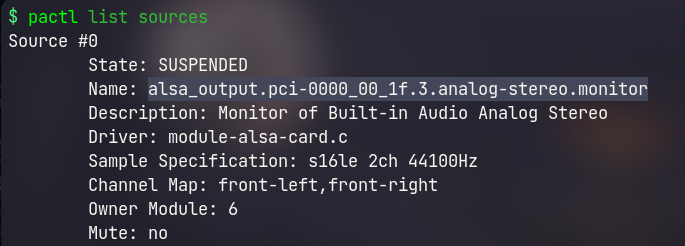
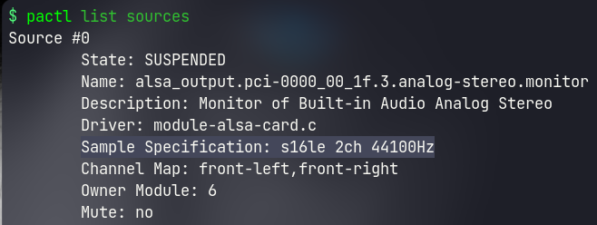

# record-with-ffmpeg

Record your desktop audio, microphone and  video in linux from terminal.

## Features
- fully command line tool
- Different options for recording
    - Internal/monitor audio only
    - Microphone only
    - Both internal audio and microphone
    - Video only (without audio)
    - Video with internal audio
    - Video with microphone
    - Video with both internal audio and microphone

## Dependencies
- pulseaudio
- ffmpeg

## Installation

### 1. Get the installation script in your system.

```
git clone https://github.com/whoisYoges/record-with-ffmpeg \
	cd record-with-ffmpeg/
```

### 2. Make necessary changes in [record-with-ffmpeg](record-with-ffmpeg)

Changes need to be made in following variable fields.

- **videodir**	(location to save the recorded videos)
- **audiodir**	(location to save the recorded audio)
- **recordingresolution**	(resolution of your monitor or specific area of monitor you want to record)
- **outputresolution**	(output video resolution (recommended <= recordingresolution))
- **fps**	(required video output fps)
- **cfr**	(Constant Rate factor ([know more about crf](https://slhck.info/video/2017/02/24/crf-guide.html)))

Get following audio input sources using `pactl list sources` command under `Name` section in terminal.



- **monitoraudioinput**	(internal/system/monitor audio)
- **microphoneaudioinput**	(external/microphone audio)

Also check audiochannel and audiofrequency value using `pactl list sources` command under `Sample Specification` section



for eg: if output has:: `Sample Specification: s16le 2ch 44100Hz`
then audiochannel is 2 (i.e, audio channel) and audiofrequency is 44100 (i.e, audio rate/frequency)

- **monitoraudiochannel**	(number of audio channel of builtin/monitor audio source)
- **microphoneaudiochannel**	(number of audio channel of microphone)
- **monitoraudiofrequency**	(audio frequency of builtin/monitor)
- **microphoneaudiofrequency**	(audio frequency of microphone)
- **outputaudiofrequency**	(output audio frequency (recommended: smaller among audio inputs))

### 3. Place it in the path.

```
chmod +x record-with-ffmpeg \
	sudo mv record-with-ffmpeg /usr/local/bin/ \
	cd ../ \
	rm -r record-with-ffmpeg
```

## Uninstallation

```
sudo rm /usr/local/bin/record-with-ffmpeg
```
